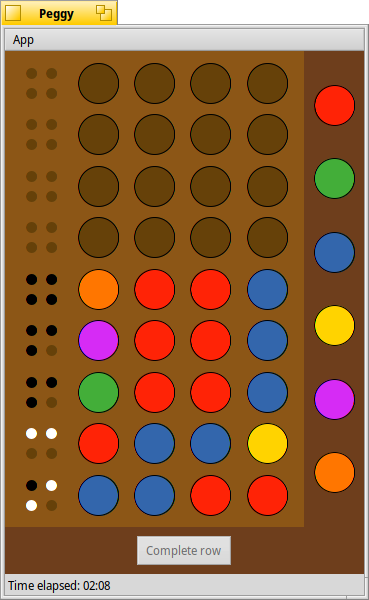

# Peggy

A board game for Haiku inspired by Mastermind™.

## Prerequisites
Peggy should compile and run under any version of Haiku that is not too ancient.
A C++11 capable compiler is required, so remember to do a *setarch x86* on 32bit Haiku.

## Compiling
Compiling is done using the makefile engine supplied with Haiku. A simple *make* compiles the code,
and *make bindcatalogs* adds the translations.

After that, you can run *Peggy* from the generated *objects.xxxxx* directory.

